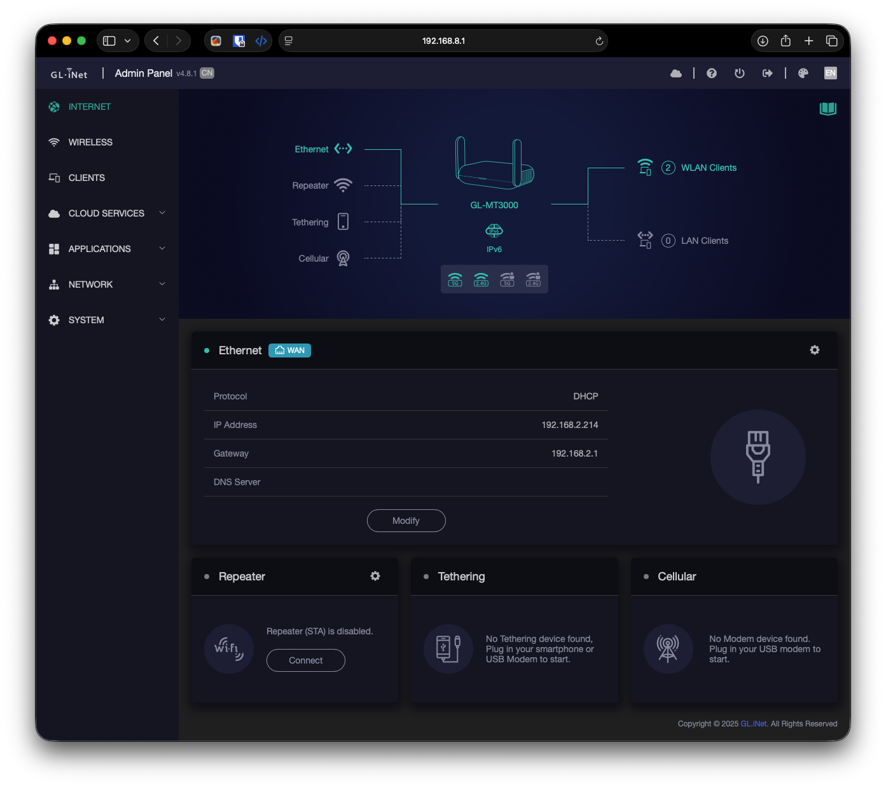
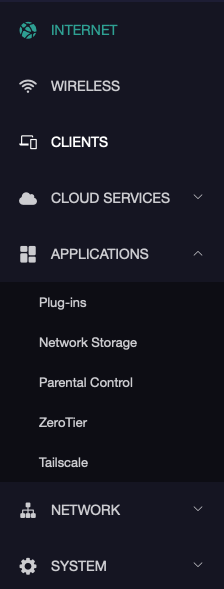
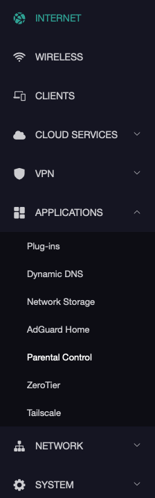
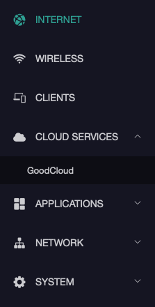
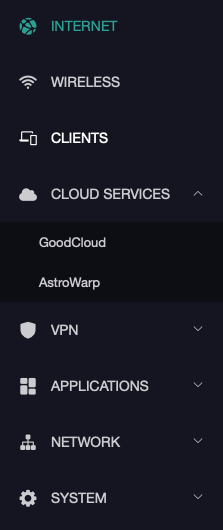
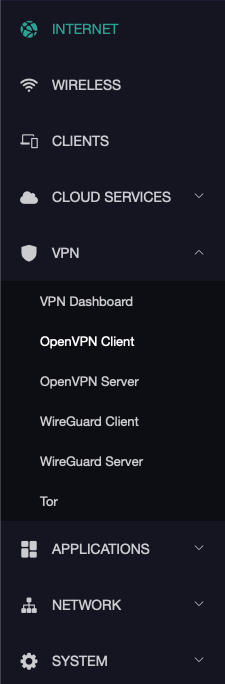
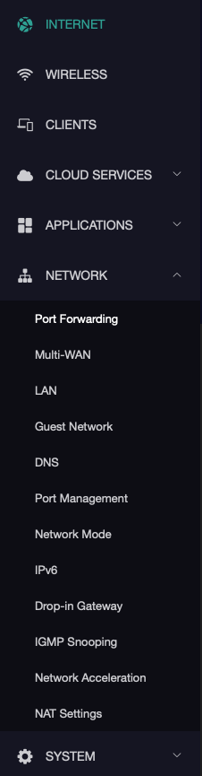
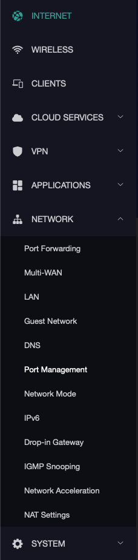
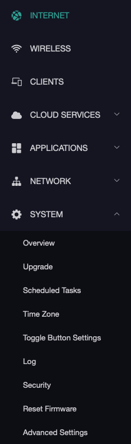
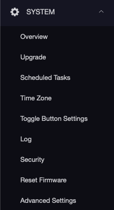

# gli-beryl-ax-region-unlock

Restore the hidden **VPN**, Tor, AdGuard Home, Dynamic DNS and AstroWarp pages on
GL.iNet routers that shipped with the **CN** region code.

Developed and verified on the **GL-MT3000 (Beryl AX)** running firmware **4.8.1**.
The method is not model-specific, but the flash layout is — read
[Known differences on other models](#known-differences-on-other-models) before
running it on anything else.

<sub>Also searchable as: GL-MT3000 · Beryl AX · GL.iNet China version · CN version ·
no VPN option · VPN menu missing · WireGuard/OpenVPN pages hidden · convert CN to
global · country code · region lock.</sub>

> **Not affiliated with, endorsed by, or supported by GL.iNet.**
> The permanent method writes to flash and can leave you with a router whose
> radios do not work. Read [What can go wrong](#what-can-go-wrong) first.

---

## Is this your problem?

Two unrelated faults are documented here. They turned up on the same router, but
you may only have one of them.

**1. The VPN pages are missing from the admin panel.**

You bought a GL.iNet router in mainland China. There is nowhere to add a
WireGuard or OpenVPN config — no *VPN Client*, no *VPN Server*. Updating the
firmware does not bring them back, and a factory reset does not either.
Confusingly, **Tailscale and ZeroTier are still there** under Applications, so it
looks like VPN support works in general. It does not, for the classic VPN
clients, and no setting in the panel turns them on.

→ You are in the right place. Start at
[Read this before you change anything](#read-this-before-you-change-anything).

*Searched as: GL-MT3000 no VPN option · Beryl AX VPN menu missing · GL.iNet China
version no WireGuard · CN firmware hides VPN · convert GL.iNet CN to global ·
region lock · country code.*

**2. A Tailscale exit node works on the router, but not on anything behind it.**

The router itself has internet and `tailscale status` looks healthy. Every phone
and laptop on its LAN times out — pages hang, apps never load. This one has
**nothing to do with the region code**: it affects any GL.iNet router, in any
region, patched or not.

→ [docs/TAILSCALE-EXIT-NODE.md](docs/TAILSCALE-EXIT-NODE.md)

*Searched as: GL.iNet exit node no internet on clients · Tailscale exit node LAN
devices no internet · router works but clients don't · tailscale0 masquerade ·
GL-MT3000 exit node not working.*

---

## If someone just pointed you here

Read this part even if you skip the rest.

This tool changes bytes in a flash partition on your router. Most of what it does
is safe and reversible, and one of the two options never touches flash at all. But
the permanent option carries a real risk that is worth understanding *before* you
type anything.

- The partition it writes to also holds your router's **MAC addresses and Wi-Fi
  radio calibration data**. Those are unique to your individual unit and exist
  nowhere else — not in any firmware image you can download, not at GL.iNet, not
  on any other router of the same model.
- If the write is interrupted — power cut, unplugging, pressing reset — that data
  can be destroyed. The symptom is a router whose Wi-Fi no longer works, and
  **reinstalling the firmware does not fix it**, because firmware images do not
  contain your unit's calibration.
- **The backup this tool takes is the only thing that can undo that.** Take it,
  and copy it off the router, before you patch. That is not cautious advice you
  can skip; it is the entire safety net.
- In the worst case — a router that will not boot and cannot be reached over the
  network at all — recovery means **opening the case and connecting to the serial
  pads on the circuit board** to restore your backup or get a console. That needs
  a USB-to-serial adapter, soldering or pogo pins, and some comfort with
  bootloader consoles. **This repo deliberately does not document that procedure.
  It has not been tested here, and the pad locations on this model have not been
  verified**, so do not run the risky path assuming you have that fallback.

If any of that sounds like more than you want to take on, **use `soft` instead**
([step 3](#3-the-safe-option)). It unhides exactly the same pages, is undone with
one command, and cannot damage anything. The only thing you give up is that it
does not survive a factory reset or a firmware upgrade that discards settings.

And if all you actually wanted was **Tailscale — it already works** on a CN
device, with no changes at all. See the table below.

---

## Read this before you change anything

**Your CN firmware is not crippled, and it is probably not missing the thing you
came here for.**

Every VPN package, kernel module and UI component ships on a CN unit and is
already installed — `wireguard-tools`, `kmod-wireguard`, `openvpn-openssl`,
`tailscale`, `zerotier`, and even the UI packages for the pages you cannot see.
The region code does not remove software. It changes one string that the admin
panel reads to decide which menu entries to draw.

Working on a stock, unmodified CN device:

| | |
|---|---|
| **Tailscale** | Full page under Applications |
| **ZeroTier** | Full page under Applications |
| **AdGuard Home** | Installable and manageable from the Plugins page |
| **GoodCloud** | Available |
| NAS, Parental Controls, all Network and System pages | Available |
| **WireGuard / OpenVPN** | Packages installed and usable from CLI or LuCI — only GL's config UI is hidden |


What you actually lose on CN:

| Page | Menu location |
|---|---|
| VPN Dashboard, WireGuard Client/Server, OpenVPN Client/Server | VPN (the whole top-level menu disappears) |
| Tor | VPN |
| AdGuard Home | Applications (still reachable via Plugins) |
| Dynamic DNS | Applications |
| AstroWarp / SD-WAN | Cloud Services (leaving only GoodCloud) |

Plus one runtime effect: `/etc/init.d/mptun` re-disables GL's tunnel datapath on
every boot while the region is CN.

---

## Before and after

Same device, same firmware 4.8.1, same English UI. The only thing that changed is
one byte in flash.

### Header

The admin panel prints a `CN` region badge next to the firmware version. After
the change the badge is gone entirely — it does not become `CA`.

| CN (stock) | CA (patched) |
|---|---|
|  |  |

### Dashboard

The whole panel, for context. Two things change: the sidebar gains a **VPN**
entry, and the status row under the router graphic goes from just `IPv6` to
`AdGuard · IPv6 · VPN · Tor`.

| CN (stock) | CA (patched) |
|---|---|
|  |  |

### Applications

Dynamic DNS and AdGuard Home appear. ZeroTier and Tailscale were **already there
on CN** — they are not affected by the region code at all.

| CN (stock) | CA (patched) |
|---|---|
|  |  |

### Cloud Services

AstroWarp appears alongside GoodCloud. This one is gated by
`"country": {"exclude": true, "codes": ["cn"]}` rather than `lang_hide`.

| CN (stock) | CA (patched) |
|---|---|
|  |  |

### VPN

There is no CN screenshot to pair with this, because on CN the entire VPN
top-level menu is absent — every one of its children is hidden, so the parent
never renders. That absence is visible in the CN screenshots above.



All six entries match the six `menu.d` files carrying `lang_hide`.

### Unchanged

Network and System are identical in both states — same entries, same order —
which is what you would expect given that no menu file under those parents
carries a region flag.

| CN (stock) | CA (patched) |
|---|---|
|  |  |
|  |  |

Full technical breakdown, with the code and the measurements:
**[docs/FINDINGS.md](docs/FINDINGS.md)**.

> **Using this router as a Tailscale exit-node gateway?** There is a separate
> GL.iNet bug where the router gets internet through the exit node but every
> device behind it does not — GL creates the `tailscale0` firewall zone without
> masquerading, so client packets enter the tunnel with un-NAT'd private source
> addresses and the replies never come back. Unrelated to the region code.
> Cause, fix, and a self-healing install for unattended routers:
> **[docs/TAILSCALE-EXIT-NODE.md](docs/TAILSCALE-EXIT-NODE.md)**.

---

## How the gate works

Menu entries live in `/usr/share/oui/menu.d/*.json`. The VPN ones carry
`"lang_hide": ["zh-cn"]`; Tailscale's does not. The filter in `/www/js/app.*.js`:

```js
return !(
    countryCode.toLowerCase().indexOf("cn") >= 0 &&
    lang_hide != null && lang_hide.includes("zh-cn")
)
```

A page is hidden only when the device country code contains `cn` **and** the page
is flagged. Despite the key's name, your chosen interface language is irrelevant.

There is no whitelist of approved regions — anything that is not `CN` opens
everything. `CA` works exactly as well as `US`. Pick the code for where you
actually are, since the same value is the one you want for the Wi-Fi regulatory
domain, and that one *does* have a fixed list.

Which codes are valid, and why the answer differs between the two settings:
**[docs/COUNTRY-CODES.md](docs/COUNTRY-CODES.md)**.

---

## Two ways to do it

| | `soft` (UCI override) | `patch` (flash write) |
|---|---|---|
| Touches flash | No | Yes — 1–2 bytes |
| Can brick the device | No | **Yes** |
| Reversible | One command | Only from a backup |
| Clears the `mptun` gate | Yes | Yes |
| Restores the hidden UI pages | Yes | Yes |
| Survives reboot | Yes | Yes |
| Survives firmware upgrade *keeping settings* | Yes¹ | Yes |
| Survives upgrade *without* keeping settings | No | Yes |
| Survives factory reset | No | Yes |

¹ `/lib/upgrade/keep.d/base-files` lists `/etc/config/` wholesale, so the override
survives a keep-settings upgrade. But `board_special` is owned by the
`gl-sdk4-base-files` package and is **not** registered as a conffile, so a package
update that rewrites it drops your change silently.

Both were verified independently on the reference device: the override restored
the VPN section on its own, and after removing it the flash patch alone kept the
section present across a reboot.

**Neither method changes your Wi-Fi regulatory domain.** That is a third,
separate setting — see [step 5](#5-wi-fi-regulatory-domain--do-not-skip-this).

**Start with `soft`.** It is free to try and free to undo.

---

## Usage

### 0. Prerequisites

You need a shell on the router. The script runs **on the router**, not on your
computer — you copy it across with `scp`, then run it inside an `ssh` session.

**You will be asked for a password — twice.** Once by `scp` when you copy the
script over, once by `ssh` when you log in. That is SSH asking, not the script;
the script itself never prompts for credentials, because by the time it runs you
are already authenticated. (If you would rather not type it repeatedly, install a
key once with `ssh-copy-id root@192.168.8.1`.)

**Credentials.** The SSH user is `root`, and the password is **the same one you
log into the admin panel with**. There is no separate SSH password. If you have
never set an admin password, do that in the web UI first.

**You will want two terminals.** One stays SSH'd into the router; the other stays
on your own machine for copying the backup off. Several steps below are explicit
about which is which, because pasting a `scp` command into the router's shell
just copies the router to itself.

**Address.** `192.168.8.1` by default. If you changed the LAN IP, use yours.

**Enable SSH.** On firmware 4.x it is off by default:

> Admin panel → **System** → **Advanced Settings** → opens LuCI →
> **System** → **Administration** → **SSH Access** →
> set Interface to `lan`, Port `22` → **Save & Apply**

**Connect over Ethernet if you can.** Everything here works over Wi-Fi, but the
`wifi` step reloads the radios and will disconnect a Wi-Fi client. The script
defends against that with an automatic rollback, but a cable removes the problem.

**Windows.** Use PowerShell's built-in `ssh`/`scp`, or PuTTY's `pscp`
(`pscp glinet-region.sh root@192.168.8.1:/tmp/`).

Verify you can get in:

```sh
ssh root@192.168.8.1
```

### 1. Copy the script over

```sh
scp -O glinet-region.sh root@192.168.8.1:/tmp/
ssh root@192.168.8.1
chmod +x /tmp/glinet-region.sh
```

> **`/tmp` is a ramdisk.** Everything you put there — this script and any backup
> — is gone after a reboot. Since patching requires a reboot, expect to re-upload
> the script afterwards. Never leave your only copy of a backup in `/tmp`.

<details>
<summary>Tip: running read-only commands without copying anything</summary>

You can pipe the script straight in for the commands that only read:

```sh
ssh root@192.168.8.1 'sh -s status' < glinet-region.sh
```

Handy for checking a device before deciding to do anything to it.

**This does not work for `patch` or `restore`**, and that is deliberate. Piping
the script into `sh -s` makes the script itself the standard input, so there is
no keyboard left for the `YES` prompt to read from. Those commands see junk
instead of `YES` and abort without writing. Upload the script and run it from a
real SSH session for anything that modifies the device.

</details>

### 2. Always start here (read-only)

```sh
/tmp/glinet-region.sh status
```

Prints your model, firmware, the Factory partition it detected, whether that
partition is mounted, and the country code from flash *and* from the kernel. If
it cannot find a partition labelled `Factory` it says so and refuses to continue
— **do not try to patch a device it cannot map.**

### 3. The safe option

```sh
/tmp/glinet-region.sh soft CA
```

Hard-refresh the admin panel. Undo with `/tmp/glinet-region.sh soft-undo`.

### 4. The permanent option

**Terminal A — on the router.** Take the backup twice: once to the ramdisk, once
to the router's own flash so a reboot cannot lose it.

```sh
/tmp/glinet-region.sh backup                          # -> /tmp (ramdisk)
/tmp/glinet-region.sh backup /root/factory_backup.bin # -> survives reboot
```

Note the md5 it prints.

**Terminal B — on your own computer.** Now get a copy off the device entirely.
This is the step people skip, and it is the one that saves you:

```sh
scp -O root@192.168.8.1:/root/factory_backup.bin ~/factory-GL-XXXXXXXXXXXX.bin
md5 -q ~/factory-GL-XXXXXXXXXXXX.bin    # macOS   (md5sum on Linux/WSL)
```

Use the serial `backup` printed in Terminal A in place of `GL-XXXXXXXXXXXX`.
Naming the file after the serial costs nothing now and matters a great deal if
you ever own two of these — the images are unit-specific, and restoring the
wrong one writes another router's MACs and RF calibration into this one. See
[Telling your backups apart](docs/RECOVERY.md#telling-your-backups-apart).

It must match the md5 from Terminal A exactly. Put the file somewhere permanent
and backed up — **not** Downloads, not a scratch folder. If the write goes wrong
this file is the only thing that can restore your MAC addresses and radio
calibration; no firmware image contains them.

**Terminal A again — the actual patch.**

```sh
/tmp/glinet-region.sh patch CA
reboot
```

After the reboot `/tmp` is empty, so re-upload the script from Terminal B before
continuing to the Wi-Fi step:

```sh
scp -O glinet-region.sh root@192.168.8.1:/tmp/
```

`patch` refuses unless all of these hold:

- a partition labelled `Factory` exists and is **not** mounted
- the bytes at `0x88` are a plausible 2-letter uppercase code
- a backup exists **and its md5 matches the live partition** — a stale backup is
  useless for recovery, so it is treated as no backup at all
- you type `YES`

After writing it re-dumps the partition and diffs it byte for byte against the
backup. If more bytes changed than the country code itself, it tells you to
restore immediately instead of reporting success.

### 5. Wi-Fi regulatory domain — do not skip this

**Changing the region code does not change your Wi-Fi regulatory domain.** They
are two independent settings, and `soft`/`patch` only touch the first one. After
patching, your radios are still on whatever domain they shipped with — `CN` on a
Chinese unit — which governs the channels and transmit power they are allowed to
use. Leaving it means transmitting under the wrong country's RF rules.

```sh
/tmp/glinet-region.sh wifi CA
```

This reloads the radios, so **it disconnects Wi-Fi clients**, including you if
that is how you are connected. To make that safe, the command arms a detached
rollback watcher *before* applying: if you do not confirm within 120 seconds it
restores the previous values and reloads again, so a bad regulatory domain cannot
lock you out of a router you can only reach over Wi-Fi.

So once you have reconnected:

```sh
/tmp/glinet-region.sh wifi-confirm
```

If you are on Ethernet and do not want the safety net, `wifi CA --now` applies
immediately with no rollback.

If the watcher cannot be armed, the command **changes nothing** and tells you to
use Ethernet — it will not leave you exposed.

### 6. Verify

```sh
cat /proc/gl-hw-info/country_code     # your new code, after a reboot
/tmp/glinet-region.sh status          # region + Wi-Fi domain in one view
```

Then hard-refresh the admin panel (Cmd/Ctrl+Shift+R) and log out and back in —
it caches its menu list. The `CN` badge next to the firmware version disappears.

### 7. Reverting

To undo a flash patch, write the old code back. That is another 1–2 byte change
and is much safer than rewriting the whole partition:

```sh
/tmp/glinet-region.sh backup          # /tmp was wiped by the reboot
/tmp/glinet-region.sh patch CN
/tmp/glinet-region.sh wifi CN
reboot
```

`restore` exists for the case where a patch went wrong and you need the original
image back wholesale — see [docs/RECOVERY.md](docs/RECOVERY.md).

---

## What can go wrong

The country code sits at offset `0x88`, inside the **first erase block** of the
Factory partition. Writing through `/dev/mtdblockN` does a
read-modify-**erase**-write of that whole block, which also holds:

- both MAC addresses
- the device serial numbers
- Wi-Fi RF calibration data

For a moment during the write that block is erased. **Lose power in that window
and you can end up with dead radios and no MAC addresses.** Reflashing firmware
does not fix it — firmware images do not contain your unit's calibration data.
Only your backup does. That is why `patch` will not run without a verified one.

1. Take the backup and **copy it off the router**.
2. Use reliable power — not a flaky USB port or hub.
3. Do not touch the reset button or mode switch during the write.
4. Prefer `soft` if you do not need permanence.

If something goes wrong: **[docs/RECOVERY.md](docs/RECOVERY.md)**.

---

## Where this does not apply

**This is a GL.iNet firmware patch, not an OpenWrt one.** Every part of the gate
lives in GL's proprietary layer:

| Component | What it is |
|---|---|
| `/usr/share/oui/menu.d/*.json` + the panel JS filter | GL's admin UI (`oui`) |
| `/etc/init.d/mptun` | GL's tunnel datapath service |
| `get_country_code()` in `/lib/functions/gl_util.sh` | GL's helper |
| `/proc/gl-hw-info/country_code` | GL's kernel module |
| `board_special` UCI config | GL's config namespace |

**On vanilla OpenWrt none of these exist**, so:

- `soft` does nothing — no code reads `board_special.hardware.country_code`.
- `patch` still flips the byte, but nothing reads it to gate anything.
- **And you would not want it anyway.** Vanilla OpenWrt has no region gate at
  all. WireGuard and OpenVPN are ordinary packages you install. There is nothing
  to unlock, which is why "just install OpenWrt" is a legitimate alternative
  answer to the same problem rather than a competing method.

**GL firmware on a newer OpenWrt base is untested.** Everything here was measured
on 4.8.1, which is built on OpenWrt 21.02. GL also ships firmware tracks built on
much newer OpenWrt releases. The GL layer above almost certainly still exists
there — it is what makes a GL router a GL router — but whether the paths, the UI
filter and the `0x88` offset are unchanged has **not** been verified. Run
`status` first; it reads the flash and `/proc` without writing anything, and it
refuses to continue if it cannot map your device.

---

## Tested on

Developed and verified end-to-end on exactly one device. Treat any other model or
firmware base as unverified.

| | |
|---|---|
| Model | GL-MT3000 (Beryl AX), purchased in China |
| Firmware | 4.8.1 |
| Base | OpenWrt 21.02-SNAPSHOT, target `mediatek/mt7981` |
| Kernel | 5.4.211, `aarch64_cortex-a53` |
| Flash | 256 MiB SPI-NAND |
| Factory partition | `mtd3`, 2 MiB, 128 KiB erase size, not mounted |
| Country code offset | `0x88` (136), value `CN` |
| Change applied | `CN` → `CA` |
| Bytes changed | **1** (`0x89`: `0x4E` `'N'` → `0x41` `'A'`) |

Verification performed:

- full 2 MiB re-dump diffed against the pre-write backup — exactly 1 byte differed
- reverted to `CN` and re-dumped — **md5 bit-identical to the original backup**,
  confirming the operation is cleanly reversible
- re-applied `CA` — md5 bit-identical to the first `CA` dump
- MAC addresses, serial numbers and radios intact throughout
- full system snapshots diffed between states: installed packages, init script
  states, rpc modules and `/etc/config` were **identical**
- Wi-Fi domain moved `CN` → `CA` via the commit-confirm path, over a Wi-Fi-only
  connection with no cable attached, and the client reassociated normally

### Known differences on other models

The Factory partition is **not** always `mtd3`, and its number has changed
between firmware releases on the same model — there are reports of the old fixed
`mtdblock3` instruction failing on 4.7.0 because the partition moved. This script
therefore resolves the partition by label at runtime and refuses to guess. Other
GL.iNet devices store the code on different media entirely (`/dev/mmcblk0boot1`
on the MT2500, `/dev/mmcblk0p2` on the MT6000); this script does not handle them.

---

## Legal and regulatory note

Set a country code that matches where the router actually is. The value drives
Wi-Fi channel availability and transmit power limits, and the wrong regulatory
domain can put you outside your local RF rules. This is for enabling
functionality on hardware you own, in the region where you are using it.

---

## License

MIT — see [LICENSE](LICENSE).
